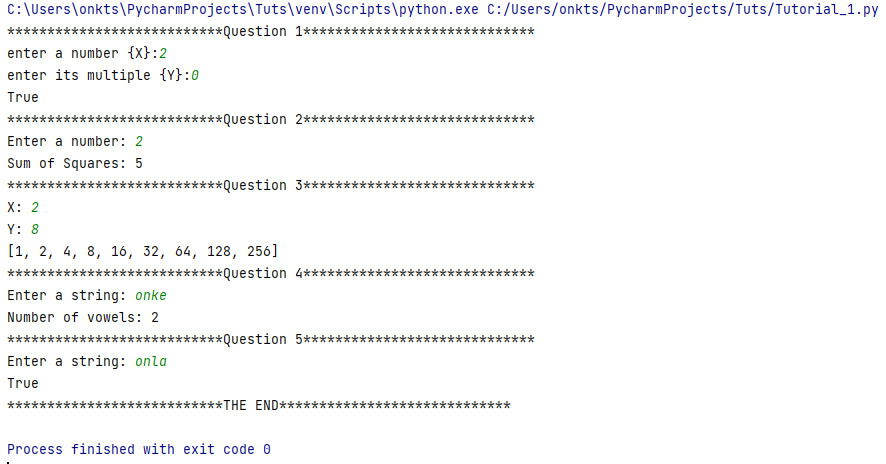

# Tutorial 1
Python tutorial without using built-in math functions

**Data Structures**

**Question 1** 
Write a Python function is_multiple(x,y) which returns True if x is a multiple of y and False if 
x is NOT a multiple of y.

**Question 2** 
Write a Python function sum_squares(x) which returns the sum of all squares from 0 up to 
and including the square of x (do not use the Math module for this question).

**Question 3** 
Write the Python function create_list(x,y) which returns a list containing x0 up to xy
. E.g 
create_list(2,8) returns the list [1,2,4,8,16,32,64,128,256] 
Be sure to use a loop and NOT just make an assignment.

**Question 4** 
Write a Python function num_vowels(text) which will return the number of vowels in the 
string “text”

**Question 5** 
Write a Python function distinct(data) which returns True if the letters in data are different 
and False if they are not.

 **Answers** 

